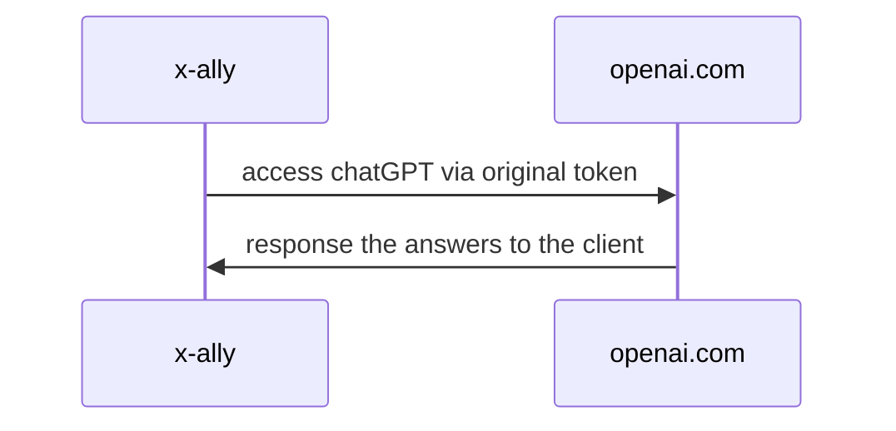
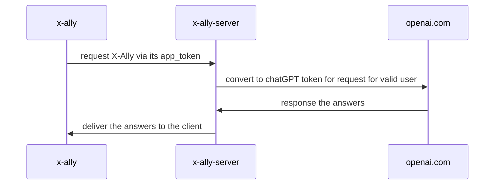

# X-Ally

(v0.1.11)
[TOC]

<div align="center">
  
</div>

<a href="https://www.producthunt.com/posts/x-ally?utm_source=badge-featured&utm_medium=badge&utm_souce=badge-x&#0045;ally" target="_blank"></a>

[中文版](README_cn.md)


X-Ally is an elegant command line client and relay server for [openai.com](https://openai.com/) ChatGPT. It provides:
- mac/linux/windows support;
- Local mode and centralized sharing mode( to avoid to share openai key within a group / organization);
- Local logging the conversation in Markdown format. Super easy to integrate with Obsidian if you need;
- Role-based configuration of prompt management, once configured, used every day.


#### Installation
There are serveral ways to install X-Ally. On macOS/Linux you can install it via [HomeBrew](https://brew.sh/) as shown below:
```bash
# add tap, only for the first time
brew tap robinmin/tap

# install
brew install xally

# upgrade new version
brew upgrade xally
```

You also can install it via [Scoop](https://scoop.sh/) on Windows as shown below:
```bash
scoop bucket add robinmin https://github.com/robinmin/scoop-bucket.git
scoop install robinmin/xally
```

Meanwhile, you can download it directly from [github download](https://github.com/robinmin/xally/releases/). Or, you can download the source code and comiple it by yourself.

```bash
# via source code
go get -u github.com/robinmin/xally
make build
```

#### How to use centralized sharing model

If you are using the centralized sharing model, you will need to register in xally before using it for the first time with the following command:

```bash
## input the following command in xally
config-email [your_email_address] [your_xally_server_address]
```

Please replace the above `your_email_address` with the real email address and `your_xally_server_address` with the xally_server service address (if you are a normal user, please contact your administrator).

After completing the registration, an activation email will be sent to your email address, click the activation button in the activation email to activate your user. Once activated, you can go back to xally and use it normally.

#### How to use local standalone mode
Of course, if you have your own openai API key, you can directly modify the corresponding configuration in the `{$HOME}/.xally/xally.yaml` file in the main directory. See `X-Ally YAML file configuration` for details.

#### Features

- Multi-mode access, including local stand-alone mode, centralized sharing model.
  
  - `Local stand-alone mode`：Directly connect to the original chapGPT address or build your own reliable relay address (requires a local chatGPT access token, configured in the environment variable `OPENAI_API_KEY` or specified it in the YAML file).

  - `Centralized sharing model`：Through `xally_server` as a relay server (essentially a reverse proxy server), the ability to use chatGPT is open to specific groups (the server needs to hold the chatGPT access token). All the client needs to hold is the access token of `xally_server`, which is convenient for enterprises to control and manage the permissions after importing chatGPT.

- Multiple types of interactions, including regular dialog interaction types, single-line command interaction types, and multi-line command file types.
  - `Conventional conversation type`: The command line mode is used as the main interaction mode, giving full play to the advantages of build-in roles and commands to facilitate daily access use.
  - `Single line command type`: In order to better integrate with other programs, it also provides a dialogue method to start in single line command mode, which can be found in the `xally command useage` section later. The `-c` option is the current command.
  - `Multi-line command type`: Multi-line command mode is a compound mode. You can enter multi-line input mode by typing `;` or `;` directly at the end of the line in single-line mode. You can also edit multi-line commands offline and save them to a text file, and then paste the text path directly into xally to parse them automatically (to prevent the problem that the relative path of the file cannot be found, it is recommended to use absolute path).

- Build-in commands and menus are available for users to get started in daily use. The current version has built-in commands, please refer to `xally preset commands` later.

- Multi-role access. A role is essentially a pre-configured chatGPT Prompt, and by configuring YAML, users can also configure the Prompt and launch the role themselves. This allows Prompt engineers to further explore the possibilities of chatGPT in real-world applications. See `xally YAML file configuration` later for specific xally configurations.

- Role-based input history.


#### xally command useage

For daily use, you can use the `xally --help` command to quickly view the main command line options. The following is the output of the current version:
```bash
$ xally --help
xally version: xally/0.1.11
Usage: xally [-hv] [-f config_file] [-r role] [-d history_path] [-p language_preference] [-c command]

Options:
  -c string
    	command for single line instruction
  -d string
    	specify chat history path
  -f string
    	config file
  -h	show the help message
  -p string
    	language preference, so far only support CN, JP and EN
  -r string
    	default role for command
  -v	show detail information
```

#### xally build-in command

Built-in commands include:
| build-in command | Description |
|----|----|
| ask | Ask ChatGPT, omitted |
| reset | Switch to other roles, including prompts and contexts |
| translate | Translate with DeepL |
| lookup | Look up the dictionary with DeepL |
| web-content | Load web content |
| web-summary | Summarize web page content |
| web-translate-cn | Load web content and translate it into Chinese |
| web-translate-en | Load web content and translate it into English |
| web-translate-jp | Load web content and translate it into Japanese |
| file-content | Ask ChatGPT by the file content |
| file-summary | Summarize document content |
| file-translate-cn | translate file content it into Chinese |
| file-translate-en | translate file content it into English |
| file-translate-jp | translate file content it into Japanese |
| cmd | Execute local commands and display the results back. Ensure that users can execute local commands without exiting xally |
| condif-email | use current user and email to register to current X-Ally Relay Server. Need email and Relay server endpoint |
| q、88、886、bye、quit、exit | quit |

> Note: 
>
> - The DeepL program here is manually modified after chatGPT generation. At present, there is no key on hand for the time being, so it has not been tested. Welcome feedback.


#### X-Ally YAML file configuration
The default configuration file will be created in the user's home directory, for example, in macOS it will be stored in `~/.xally/xally.yaml` and will be created automatically if the file is missing at startup. If the file is missing at startup, it will be created automatically. For other OS, the same applies. You can also specify it with the command line statement `-f`. The default file looks like this:
```yaml
system:																						# This section is used to define various configurations related to xally itself
  sentry_dsn: 																		# sentryDSN for error tracking
  chat_history_path: /Users/xxxxx/xxx/xally/data  # conversation history markdown file storage location
  log_path: logs																	# system log storage location
  log_level: info																	# default log level
  peference_language: CN													# User language preference (currently supports Chinese, Japanese and English language interfaces, corresponding to CN/JP/EN respectively)
  default_role: fullstack													# The default startup role, which corresponds to the roles configuration later
  # api_endpoint_openai: https://api.openai.com/v1			# Original openai service endpoint
  api_endpoint_openai: https://user_defined_domain/v1/ 	# User-defined domain name openai service access endpoint
  # api_endpoint_openai: http://127.0.0.1:8090/v1				# User-built x-ally-server openai service endpoint
  api_endpoint_deepl: https://api-free.deepl.com/v2			# Original deepl service endpoint
  api_orgid_openai:																			# Organization ID assigned by openai
  use_shared_mode: 0															# Whether to enable x-ally-server, 0 is disabled, 1 is enabled
  app_token: 21e9270f-09e2-4248-9b04-d43f4c89c9b5 # The access token assigned by the x-ally-server
  email: minlongbing@gmail.com										# Current user email, used to activate x-ally-server authorization
roles:																						# This section is used to define the various preset roles
  assistant:																			# Role name as the key
    name: assistant															  # Role name
    avatar: 🧰																	  # Current role representative icon for easy display at the command line
    temperature: 0.2														  # openai response accuracy control parameters (between 0.2~2, the smaller the value the more accurate)
    top_p: 1																		  # As above, openai replies to the precision control parameter. With temperature can only choose one of two control
    prompt: You are a ChatGPT-based daily chit-chat bot with answers that are as concise and soft as possible..   # Role specific prompt
  expert:
    name: expert
    avatar: 🐬
    temperature: 0.2
    top_p: 1
    prompt: You are ChatGPT, a large language model trained by OpenAI. Answer as concisely as possible.
  architect:
    name: architect
    avatar: 🏡
    temperature: 0.2
    top_p: 1
    prompt: .......

```
> Note:
>
> - By adjusting the configuration YAML file, you can choose to access the chatGPT original address directly or through a custom domain. This is exceptionally friendly for people in certain regions for well-known reasons. Combined with the centralized sharing model, it is very friendly for enterprises to import chatGPT capabilities.
> - Prompt is the basis of AI application. For the specific role Prompt, please refer to various social networking sites and experience sharing sites.


#### X-Ally-Server YAML file configuration(Optional)
If you don't need to use the relay service, you don't need to configure this file. The default configuration file is created in the user's home directory, e.g. `~/.xally/xally_server.yaml` for macOS, and will be created automatically if it is missing at startup. If the file is missing at startup, it will be created automatically. For other OSes, the same applies. You can also specify it with the command line statement `-f`. The default file looks like this:
```yaml
server:
  db_host: 127.0.0.1												# database server host
  db_port: "3306"														# database server port
  db_user: user														  # database user name
  db_password: password											# database user password
  sentry_dsn: 															# sentryDSN for error tracking
  openai_api_key:														# original openai API key on server side
  openai_org_id:														# original openai orgnization ID
  app_token: 1234567890											# app_token for X-Ally-Server
  app_token_lifespan: 1											# Server-side token expiration time (hours)	
  white_list_refresh_interval: 300					# Whitelist refresh interval(seconds)
  listen_addr: ":8090"											#Server-side listening address
  external_endpoint: https://your_domain_name/v1	# External exposure of service address for email activation of accounts
  smtp_server: 															# SMTP server host
  smtp_port: 587														# SMTP server port
  smtp_username: 														# SMTP user name
  smtp_password: 														# SMTP user password
  direct_email_notify: true									# Whether the activation email is sent after the user completes registration
  email_restrict_domain: xhqb.com						# Allowed users to register email domains, empty means no restrictions
  routes:																		# Reverse proxy configuration items
    - name: openai.com											# Name of the reverse proxy configuration instance
      context: /v1/chat/completions         # Reverse proxy configuration instance of matching URL
      # target: https://user_define_domain		# Reverse proxy configuration example of the target server address (self-built service address)
      target: https://api.openai.com/v1		# Reverse proxy configuration example of the target server address (original address)

```
> Note:
> 1、After finished the configuration of xally_server, you need to register with the xally_server from client xally first using the `config-email` command. After the registration is completed, an activation email will be sent to the registered email address for activation (if the configuration has direct_email_notify as true).
> 2. Once the activation is complete, you can use the various capabilities of chatGPT through xally_server.


#### How to deploy xally_server on server side(Optional)
- You can deploy xally_server on Debina/Ubuntu as shown below. For the other OS, please refer to this as the refference.
```bash
## setup environment variable XALLY_HOME, please replace XALLY_HOME with your real oath
export XALLY_HOME=/home/your_user_name/xally

## create log folder
mkdir $XALLY_HOME/logs

## run service xally_server
nohup $XALLY_HOME/build/bin/xally_server -f $XALLY_HOME/xally_server.yaml > $XALLY_HOME/logs/xally_server.log 2>&1 &

## restart nginx
sudo systemctl reload nginx

## kill process by name
ps ax|grep xally_server|grep -v grep | awk '{print $1}' | xargs kill
```

#### Tips for using

#####  1、UI Introduction
As shown in the figure below, the user interface includes:
- User question area (within the red box)
- AI answer area (within the yellow boxt)
- Statistics of this conversation (the blue box contains parts, in order of the completion of the communication timestamp, Prompt contains the number of tokens, AI answer contains the number of tokens, the total number of tokens of this conversation and the time spent on the conversation)
- Current history message length and the number of available tokens (within the green box)
  


#####  2、Using Obsidian to store conversation records locally
If you rely on [Obsidian](https://obsidian.md/) for knowledge management, as I do, you can include xally's conversation logs in Obsidian's management. xally will automatically generate conversation logs as markdown in that directory. There are two ways to reach this option:
- Directly specified using the `-d` startup parameter;
- Specified in the `system.chat_history_path` configuration in the yaml configuration file.


> Note:
> Note that if you have iCloud enabled for syncing Obsidian data, as I do, the directory can get very complicated. My solution is to use softlink to convert the complex path into a fixed path for easy configuration, debug, etc. The command can be found below, replace it with your own directory:
>
> ```bash
> ln -s /Users/xxxxxx/Library/Mobile\ Documents/iCloud\~md\~obsidian/Documents/冰原奔狼的记事本/X-ally/ /Users/xxxxxx/.xally/data
> ```


#####  3、Key Binding
Emacs-like shortcuts are used by default to facilitate accelerated typing, including:
| Key Binding | Description                                     |
| ----------- | ----------------------------------------------- |
| Ctrl + A    | Go to the beginning of the line (Home)          |
| Ctrl + E    | Go to the end of the line (End)                 |
| Ctrl + P    | Previous command (Up arrow)                     |
| Ctrl + N    | Next command (Down arrow)                       |
| Ctrl + F    | Forward one character                           |
| Ctrl + B    | Backward one character                          |
| Ctrl + D    | Delete character under the cursor               |
| Ctrl + H    | Delete character before the cursor (Backspace)  |
| Ctrl + W    | Cut the word before the cursor to the clipboard |
| Ctrl + K    | Cut the line after the cursor to the clipboard  |
| Ctrl + U    | Cut the line before the cursor to the clipboard |
| Ctrl + L    | Clear the screen                                |
| ; | enter the multiple line mode(same as full-angle characters"；") |


#### Version History
- v0.1.0 at 2023-03-16 : refactory and implement local mode and sharing key mode.
- v0.0.4 at 2023-03-06 : get github release and brew installation ready.
- v0.0.2 at 2023-03-05 : Add deepl translate/lookup function support.
- v0.0.1 at 2023-03-04 : Project Initialize.


#### Reffernce
- [openai.com API Docs](https://platform.openai.com/docs/introduction/overview)
- [How to publish your Go binary as Homebrew Formula with GoReleaser](https://franzramadhan.com/posts/8-how-to-publish-go-binary-to-homebrew/)
- [Create a Custom CLI Tool and Distribute with HomeBrew Using Goreleaser and Github Actions](https://askcloudarchitech.com/posts/tutorials/create-homebrew-tap-golang-goreleaser-cobra-cli/)
- [Making your project available through Homebrew](https://dev.to/superfola/making-your-project-available-through-homebrew-1ll5)
- [Goreleaser Quick Start](https://goreleaser.com/quick-start/)
- [5 tips for better unit testing in Golang](https://blog.devgenius.io/5-tips-for-better-unit-testing-in-golang-b25f9e79885a)
- [The Go libraries that never failed us: 22 libraries you need to know](https://threedots.tech/post/list-of-recommended-libraries/#useful-tools)
- [html-to-markdown](https://github.com/JohannesKaufmann/html-to-markdown)
- [How to cross compile with CGO using GoReleaser and GitHub Actions](https://www.bytebase.com/blog/how-to-cross-compile-with-cgo-use-goreleaser-and-github-action)
- [goreleaser-cross-example](https://github.com/goreleaser/goreleaser-cross-example/blob/master/Makefile)
- [Cross-compiling a CGO project using Goreleaser](https://www.jvt.me/posts/2023/02/24/goreleaser-cgo-cross-compile/)
