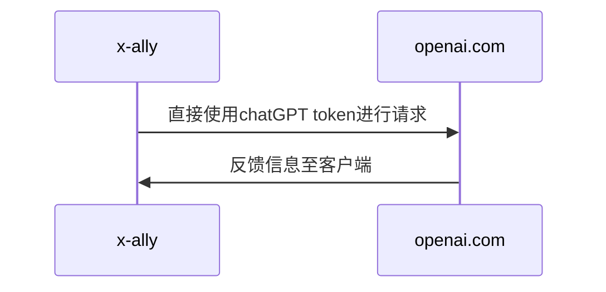
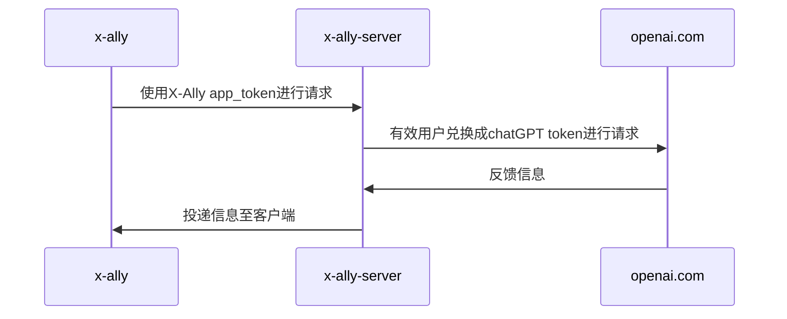

# X-Ally

(v0.1.4)
[TOC]

<div align="center">
  
</div>

 [English version](https://github.com/robinmin/xally/blob/main/README.md)

X-Ally是一个命令行界面的AI集成工具，用于辅助基于文本文字的各项工作，包括程序员、作者、翻译者以及其他各类文本内容生产者。目前主要已集成 [openai.com](https://openai.com/)  chatGPT、 [deepl.com](https://www.deepl.com/)。后续会有更多自研、三方工具集成。


#### 安装

  目前支持集几种安装模式：macOS/Linux上基于`brew`进行安装：
  ```bash
  # 仅仅首次需要添加tap
  brew tap robinmin/tap
  
  # 安装
  brew install xally
  
  # 版本更新
  brew upgrade xally
  ```

  如果使用Windows系统，也可以通过[Scoop](https://scoop.sh/) 直接安装:
```bash
scoop bucket add robinmin https://github.com/robinmin/scoop-bucket.git
scoop install robinmin/xally
```


  或者你也可以直接到[github下载页面](https://github.com/robinmin/xally/releases/))下载。当然也可以直接下载源代码、自行编译：
  ```bash
  # via source code
  go get -u github.com/robinmin/xally
  make build
  ```


#### 当前特性

- 多模式接入，包括本地单机模式、中心化共享模式。
  - `本地单机模式`：直接链接chapGPT原始地址或者自建可靠中转地址（需本地持有chatGPT访问token、配置在环境变量`OPENAI_API_KEY`中或者启动`xally`时候指定）。


  - `中心化共享模式`：通过`xally_server`作为relay服务器（本质是一个定向的反向代理），面向特定群体开放使用chatGPT的能力（服务端需持有chatGPT访问token即可）。客户端需要持有的仅仅是`xally_server`的访问token。方便企业导入chatGPT后的权限控制与管理。


- 多类型交互，包括常规对话交互类型、单行命令交互类型、多行命令文件类型。
	- 常规对话类型：将命令行模式作为主交互模式，充分发挥预置角色、预置命令优势，方便日常接入使用。
	- 单行命令类型：为了更好与其他程序集成，同时提供了单行命令模式启动的对话方式，具体可参见后文的`xally命令行帮助`章节。其中`-c`选项即为当前所属命令。
	- 多行命令类型：多行命令模式是一种复合模式。可以在单行模式的行尾直接输入`;`或`；`即可进入多行输入模式。也可以离线编辑多行命令并保存至文本文件中，然后直接在xally中贴入文本路径即可自动解析（为防止出现文件相对路径找不到的问题，建议用绝对路径）。

- 预置命令及菜单，方便用户日常上手使用。当前版本已内置指令请参考后文`xally预置命令`。

- 多角色接入。一个角色的本质是一段预置的chatGPT Prompt。通过配置YAML，用户也可以自行配置Prompt及启动角色。方便各路Prompt工程师进一步探索chatGPT在实际应用中的各种可能性。具体xally配置参见后文`xally YAML文件配置`

- 基于角色的输入历史加载与保存。


#### xally命令行帮助

为方便用户日常使用，可使用`xally --help`命令快速查看主要命令行选项。以下是当前版本的输出：
```bash
$ xally --help
xally version: xally/0.1.0
Usage: xally [-hv] [-f config_file] [-r role] [-d history_path] [-p language_preference] [-c command]

Options:
  -c string
    	command for single line instruction
  -d string
    	specify chat history path
  -f string
    	config file
  -h	show the help message
  -p string
    	language preference, so far only support CN, JP and EN
  -r string
    	default role for command
  -v	show detail information
```

#### xally预置命令

已经内置的预制命名包括：
| 预置命令 | 含义 |
|----|----|
| ask | 问ChatGPT，可省略 |
| reset | 重置角色，包括切换prompt以及清空上下文 |
| translate | 用DeepL翻译 |
| lookup | 用DeepL查字典 |
| web-content | 加载网页内容 |
| web-summary | 网页内容摘要 |
| web-translate-cn | 加载网页内容并翻译为中文 |
| web-translate-en | 加载网页内容并翻译为英文 |
| web-translate-jp | 加载网页内容并翻译为日文 |
| file-content | 问ChatGPT文件内容 |
| file-summary | 文件内容摘要 |
| file-translate-cn | 文件内容翻译为中文 |
| file-translate-en | 文件内容翻译为英文 |
| file-translate-jp | 文件内容翻译为日文 |
| cmd | 执行本地命令，并将结果回显。确保用户无需退出xally即可执行本地命令 |
| condif-email | 注册当前用户到指定X-All转发服务器. 用户需提供邮箱以及X-All转发服务器服务端点 |
| q、88、886、bye、quit、exit | 退出程序 |

> 备注：这里的DeepL程序是chatGPT生成后人工修改的。目前手上暂时无key，尚未实测。欢迎反馈


#### X-Ally YAML文件配置
默认配置文件会创建在用户主目录下，比如macOS的话会存放在`~/.xally/xally.yaml`，如果启动时缺少该文件，系统会自动创建。其他OS以此类推。也可以使用命令行语句`-f`予以指定。默认文件是这样的：
```yaml
system:																						# 本小节用于定义各种xally本身相关配置
  sentry_dsn: 																		# 用于错误跟踪的sentryDSN
  chat_history_path: /Users/xxxxx/xxx/xally/data  # 对话历史markdown文件存放位置
  log_path: logs																	# 系统日志存放位置
  log_level: info																	# 系统日志默认级别
  peference_language: CN													# 用户语言偏好(目前支持中日英三种语言界面，分别对应CN/JP/EN)
  default_role: fullstack													# 默认启动角色，与后文的roles配置相对应
  # api_endpoint_openai: https://api.openai.com/v1			# 原始openai服务接入端点
  api_endpoint_openai: https://user_defined_domain/v1/ 	# 用户自定义域名openai服务接入端点
  # api_endpoint_openai: http://127.0.0.1:8090/v1				# 用户自建x-ally-server openai服务接入端点
  api_endpoint_deepl: https://api-free.deepl.com/v2			# 原始deepl服务接入端点
  api_orgid_openai:																			# openai分配的组织ID
  use_shared_mode: 0															# 是否启用x-ally-server，0为不启用、1为启用
  app_token: 21e9270f-09e2-4248-9b04-d43f4c89c9b5 # x-ally-server所分配的访问token，由x-ally-server分配
  email: minlongbing@gmail.com										# 当前用户email，用于激活x-ally-server授权
roles:																						# 本小节用于定义各种预置角色
  assistant:																			# 当前角色名称
    name: assistant															  # 当前角色名称，同上
    avatar: 🧰																	  # 当前角色代表图标，方便命令行时展示
    temperature: 0.2														  # openai回复精度控制参数（0.2~2之间，数值越小越精确）
    top_p: 1																		  # 同上，openai回复精度控制参数。与temperature只能二选一控制
    prompt: You are a ChatGPT-based daily chit-chat bot with answers that are as concise and soft as possible..   # 具体的角色Prompt
  expert:
    name: expert
    avatar: 🐬
    temperature: 0.2
    top_p: 1
    prompt: You are ChatGPT, a large language model trained by OpenAI. Answer as concisely as possible.
  architect:
    name: architect
    avatar: 🏡
    temperature: 0.2
    top_p: 1
    prompt: .......

```
> 备注：
> 1、通过调整配置YAML文件，可选择直接接入chatGPT原始地址，也可以通过自定义域名接入。由于众所周知的原因，这一点对于某些地区的人民异常友好。配合中心化共享模式，对于企业导入chatGPT能力来说，非常友好。
> 2、Prompt是AI应用的基础。具体的角色Prompt, 可参考各社交网站、经验分享网站。


#### X-Ally-Server YAML文件配置(可选)
如果无需使用中转服务，则无需配置该文件。默认配置文件会创建在用户主目录下，比如macOS的话会存放在`~/.xally/xally_server.yaml`，如果启动时缺少该文件，系统会自动创建。其他OS以此类推。也可以使用命令行语句`-f`予以指定。默认文件是这样的：
```yaml
server:
  db_host: 127.0.0.1												# 数据库服务器地址
  db_port: "3306"														# 数据库服务器端口
  db_user: user														  # 数据库用户名
  db_password: password											# 数据库密码
  sentry_dsn: 															# 用于错误跟踪的sentryDSN
  openai_api_key:														# 服务端openai API key
  openai_org_id:														# 服务端openai组织ID
  app_token: 1234567890											# X-Ally-Server服务端应用token
  app_token_lifespan: 1											# 服务端token过期时间（小时）																	
  white_list_refresh_interval: 300					# 白名单刷新周期（秒）
  listen_addr: ":8090"											# 服务端监听地址
  external_endpoint: https://your_domain_name/v1	# 对外暴露服务地址，用于邮件激活账户
  smtp_server: 															# SMTP服务器地址
  smtp_port: 587														# SMTP服务器端口
  smtp_username: 														# SMTP用户名
  smtp_password: 														# SMTP用户密码
  direct_email_notify: true									# 用户完成注册后是否发送激活邮件
  email_restrict_domain: xhqb.com						# 允许的用户注册邮件域名，置空则表示没有限制
  routes:																		# 反向代理配置项
    - name: openai.com											# 反向代理配置实例之名称
      context: /v1/chat/completions         # 反向代理配置实例之匹配URL
      target: https://openai.robinmin.net		# 反向代理配置实例之目标服务器地址(自建服务地址)
      # target: https://api.openai.com/v1		# 反向代理配置实例之目标服务器地址(原始地址)

```
> 备注：
> 1、配置xally_server启动完成后，需要从客户端xally首先使用`config-email`指令向该xally_server进行注册。完成注册后，会主动发送激活邮件到注册邮箱进行激活（若配置有direct_email_notify为true）。
>
> 2、一旦激活完成即可通过xally_server使用chatGPT的各种能力。


#### 使用小技巧

#####  1、用户界面介绍
如下图所示，用户界面包括：
- 用户提问区域（红框包含部分）
- AI回答区域（黄框包含部分）
- 本次对话统计（蓝框包含部分，依次为完成交流时间戳、Prompt包含token数、AI回答包含token数、本次对话总token数以及对话耗时）
- 当前历史消息长度以及可用token数（绿框包含部分）。
  


#####  2、使用Obsidian在本地存储对话记录
如果你和我一样依赖 [Obsidian](https://obsidian.md/) 来做知识管理的话，可以将xally的对话记录纳入Obsidian的管理。xally会自动将对话记录以markdown的形式生成到该目录下。有两个办法来达成该方案：
- 使用`-d`启动参数直接指定；
- 在yaml配置文件中的`system.chat_history_path`配置指定。


> 备注：
> 需要注意的是，如果你和我一样开启了iCloud用于同步Obsidian数据的话，其目录会变得非常复杂。我的办法是直接用软连接将复杂路径转化成一固定路径，方便进行配置、debug等。命令可参考如下，注意替换成自己的目录：
>
> ```bash
> ln -s /Users/xxxxxx/Library/Mobile\ Documents/iCloud\~md\~obsidian/Documents/冰原奔狼的记事本/X-ally/ /Users/xxxxxx/.xally/data
> ```


#####  3、命令行快捷键
默认采用类Emacs快捷键，方便大家加速输入，包括：
| 快捷 | 描述 |
|-------------|-----------------------------------------------|
| Ctrl + A | 到行首 |
| Ctrl + E | 到行尾 |
| Ctrl + P | 上一条指令(或向上键) |
| Ctrl + N | 下一条指令(或向下键) |
| Ctrl + F | 前进一个字符 |
| Ctrl + B | 后退一个字符 |
| Ctrl + D | 删除当前字符 |
| Ctrl + H | 删除光标前所有字符(回退) |
| Ctrl + W | 将光标之前的单词剪切到粘贴板 |
| Ctrl + K | 将光标之后的所有字符剪切到粘贴板 |
| Ctrl + U | 将光标之前的所有字符剪切到粘贴板 |
| Ctrl + L | 清楚当前屏幕 |
| ; | 进入多行输入模式(或全角字符"；") |


#### 版本历史

- v0.1.0 at 2023-03-16 : 完成重构、支持本地模式及中心化共享模式
- v0.0.4 at 2023-03-06 : 完成github、brew发布
- v0.0.2 at 2023-03-05 : 添加基于[deepl.com](https://www.deepl.com/)的单词查询及翻译功能
- v0.0.1 at 2023-03-04 : 项目POC


#### 参考链接
- [openai.com API Docs](https://platform.openai.com/docs/introduction/overview)
- [How to publish your Go binary as Homebrew Formula with GoReleaser](https://franzramadhan.com/posts/8-how-to-publish-go-binary-to-homebrew/)
- [Create a Custom CLI Tool and Distribute with HomeBrew Using Goreleaser and Github Actions](https://askcloudarchitech.com/posts/tutorials/create-homebrew-tap-golang-goreleaser-cobra-cli/)
- [Making your project available through Homebrew](https://dev.to/superfola/making-your-project-available-through-homebrew-1ll5)
- [Goreleaser Quick Start](https://goreleaser.com/quick-start/)
- [5 tips for better unit testing in Golang](https://blog.devgenius.io/5-tips-for-better-unit-testing-in-golang-b25f9e79885a)
- [The Go libraries that never failed us: 22 libraries you need to know](https://threedots.tech/post/list-of-recommended-libraries/#useful-tools)
- [html-to-markdown](https://github.com/JohannesKaufmann/html-to-markdown)
